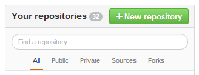
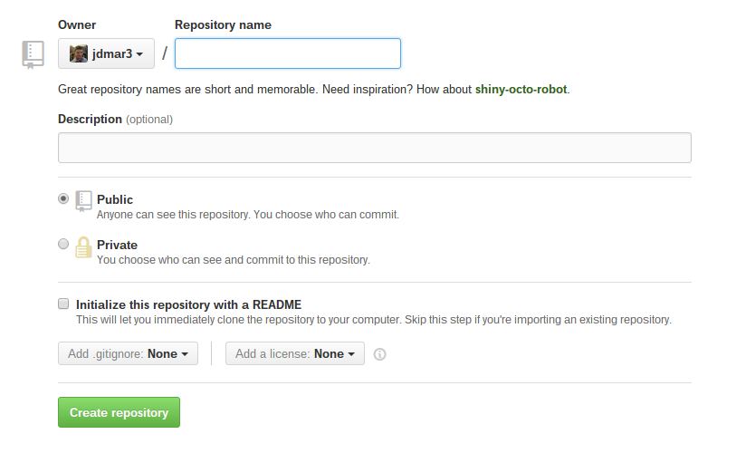
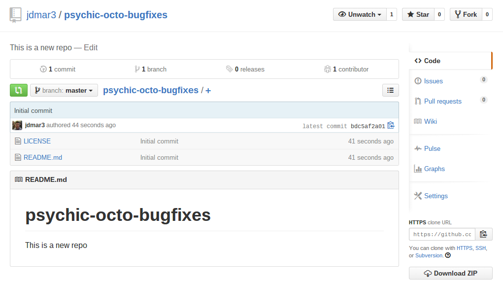
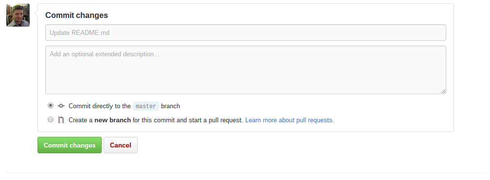
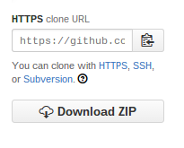

# {{ page.title }}

## Set up a GitHub repository

When you log into GitHub, you will see your dashboard. 
Click the green button that says, "New repository."

You will be taken to a screen that asks for some information. 

Several important things to consider:

1. Give the repository a name that makes it easily identifiable to you.
2. In your description, explain the purpose of the repository's contents succinctly. 
3. Consider whether you want the contents of your repository to be publicly available or not. 
4. You should initialize your repo with a README. This lets you say something more about the contents of the repository. It also serves as the landing page for anyone who happens to visit your repo's address. 
5. If you are programming or writing in a specific progamming language, choose it in the .gitignore dropdown.
6. Choose a license. You can always change or update it later. For more information about choosing the appropriate license, check out [this link](http://choosealicense.com/). 

Press the button to create the repository. 

## Edit in GitHub

The interface once in GitHub is relatively straightforward. 
To edit a file, click the name of the file and it will take you to the intreface for individual files. 
Then click the pencil icon. 

You can change the text inside the file and then add a commit message at the bottom of the page (just like committing changes with Git).

## Clone repository

To clone the repository, select and copy the text in the box illustrated below: 

Then go to CodeAnywhere and open a terminal in your DevBox. 

Type the following and then paste in the URL of the repository that you have copied to the clipboard. 

`git clone` 

Press enter to run the command and clone the repo. 
Once you have a command prompt again, you can descend into the directory (`cd CLONED-DIRECTORY`). 

Make whatever changes you like the repo. 
Add a file. 
Edit something. 
Make sure to use `git add` and `git commit` as we have previously covered in the [Git Reference Sheet](/refsheets/git-ref). 

## Updating your repo on GitHub

When you have made and committed changes locally, you can push those changes to your remote repository on GitHub. 

Make sure that you are somewhere within the directory that represents your repository on your local system. 
Then do: 

`git push`

If Git caught the URL of the repo when you cloned it, you will be asked to input your GitHub username and password. 
The password is masked, so you will not be able to see it when you are typing, but don't worry, it is there. 